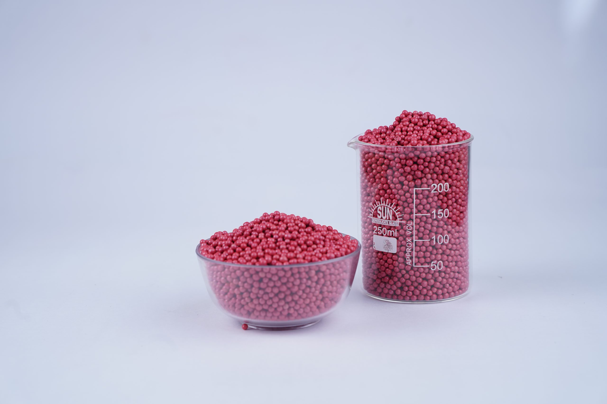
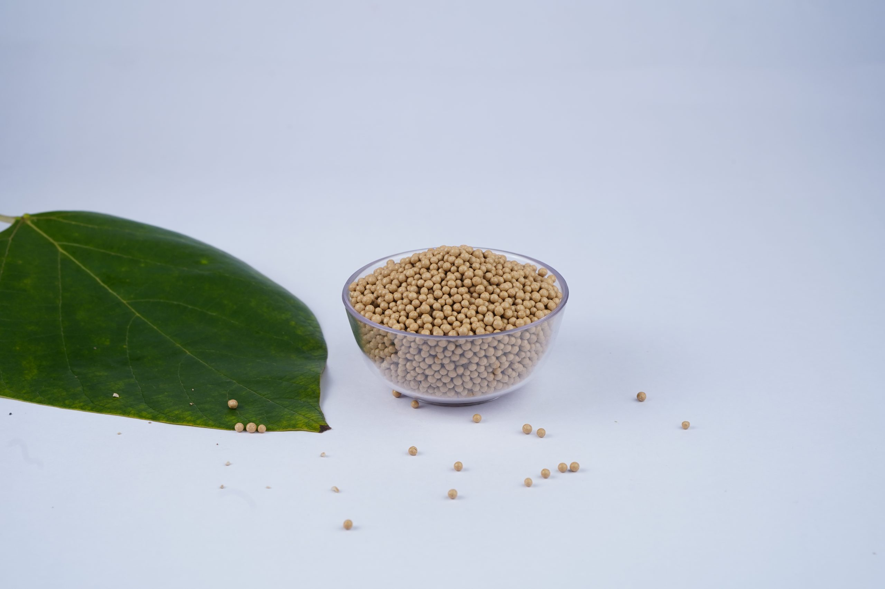
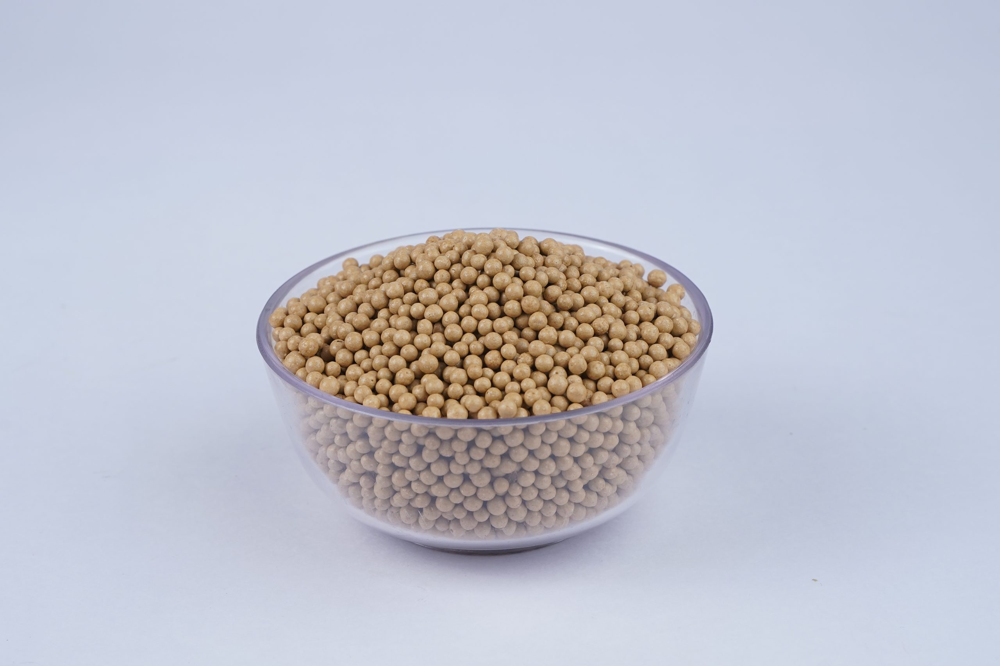

## What Are Coated Fertilizer Granules and Why Are Coatings Necessary?

Coated fertilizer granules are engineered solid nutrient cores (such as urea, NPK blends, or mineral carriers) encapsulated with a micro-thin, protective surface layer of polymers, sulfur, bio-oils, or functional mineral matrices (Gypsum, Diatomite, Dolomite). Coatings solve the three fundamental vulnerabilities of raw fertilizer salts: rapid hygroscopic moisture absorption (caking during storage), volatile atmospheric losses (ammonia volatilization and denitrification), and rapid dissolution leaching past shallow plant root zones.



---

## The Physical & Chemical Challenges of Uncoated Granules

Raw chemical fertilizer salts are inherently hygroscopic and chemically unstable when exposed to ambient atmospheric conditions:

1. **Hygroscopic Moisture Absorption and Caking:** Salts like Urea and Ammonium Nitrate have low Critical Relative Humidity (CRH). At relative humidity above 70%, granules absorb moisture from the air, dissolve at contact points, and recrystallize into solid warehouse rock upon drying (caking).
2. **Rapid Dissolution Spike and Leaching:** Uncoated water-soluble fertilizers dissolve completely within hours of irrigation, creating an osmotic salt surge that can burn tender seedling roots. Excess nitrates (NO₃⁻) leach rapidly into deep groundwater beyond root reach.
3. **Mechanical Breakage and Dust Emission:** Uncoated granules often exhibit weak crush strength (Below 2.0 kg/granule). During bulk transit and pneumatic handling, they break into abrasive dust that clogs seeders and irritates farm operators.



---

## Controlled Release Kinetics: How Coatings Regulate Diffusion

Coated granules operate via membrane barrier diffusion governed by **Fick's First Law of Diffusion**:

```
Nutrient Flux Equation:
J = -D · (dc / dx)
Where J is the nutrient release rate, D is the membrane diffusion coefficient, 
and (dc / dx) is the concentration gradient across the coating barrier thickness.
```

### 1. Water Vapor Ingress Phase
Following soil application, ambient soil moisture vapor slowly penetrates the semi-permeable coating membrane through microscopic pores.

### 2. Internal Core Dissolution
Moisture inside the granule dissolves a fraction of the solid chemical core, creating a concentrated internal osmotic solution without rupturing the coating shell.

### 3. Steady Hydrostatic Diffusion
As internal hydrostatic pressure builds, dissolved nutrient ions diffuse gradually through the coating membrane into the surrounding rhizosphere over a calibrated 30, 60, or 90 day growth window.



---

## Types of Fertilizer Coatings: Technical Comparison

| Coating Technology | Coating Material Chemistry | Release Mechanism | Mechanical Crush Strength | Environmental Biodegradability |
| :--- | :--- | :--- | :--- | :--- |
| **Polymer / Resin Coating** | Polyurethane / Alkyd resin films | Temperature-dependent diffusion | High (Above 4.5 kg) | Slow breakdown (potential microplastic residue) |
| **Elemental Sulfur Coating** | Molten elemental sulfur (S^0) | Microbial oxidation of sulfur shell | Moderate (3.0 to 3.5 kg) | 100% natural oxidation to sulfate (SO₄²⁻) |
| **Functional Mineral Matrix** | Gypsum (CaSO₄·2H₂O) / Diatomite / Silica | Capillary moisture regulation | Very High (4.0 to 5.5 kg) | 100% biodegradable; enriches soil minerals |
| **Bio-Oil / Wax Anti-Caking** | Vegetable fatty acids + mineral wax | Surface hydrophobic seal | Prevents surface dusting | 100% biodegradable within 30 days |

---

## Key Quality Parameters for Commercial Coated Granules

In B2B fertilizer manufacturing, premium coated granules must meet rigorous engineering specifications:

- **Granule Crush Strength:** Minimum 3.5 to 5.0 kg/granule (measured via digital hardness tester to guarantee zero transit breakage).
- **Uniform Sizing (SGN):** 90% retained between 2.0 mm and 4.0 mm with a Uniformity Index (UI Above 90).
- **Anti-Caking Efficiency:** Zero cake formation after 90 days under 500 kg/m² stack pressure at 80% relative humidity.
- **Moisture Content:** Strictly below 1.5% to 2.0% by weight prior to bagging.

---

## Frequently Asked Questions

### How do coated granules improve Nitrogen Use Efficiency (NUE)?
Standard uncoated urea delivers only 30% to 40% Nitrogen Use Efficiency, with the remainder lost to ammonia volatilization (NH₃) and nitrate leaching (NO₃⁻). Coated urea elevates NUE to 60% to 75%, allowing farmers to achieve equal or superior yields with 25% less total applied nitrogen.

### Can coated granules be blended with other fertilizers in bulk?
Yes. Coated granules possess hard, non-tacky hydrophobic surfaces that prevent cross-reaction and moisture transfer when blended with DAP, MOP, or micronutrient salts.

---

*J K Fertilizers specializes in advanced fertilizer coating technology, contract job work, and custom-engineered carrier granules at our Gujarat manufacturing plant. [Contact our team](/contact) to discuss contract granulation and coating specifications.*
