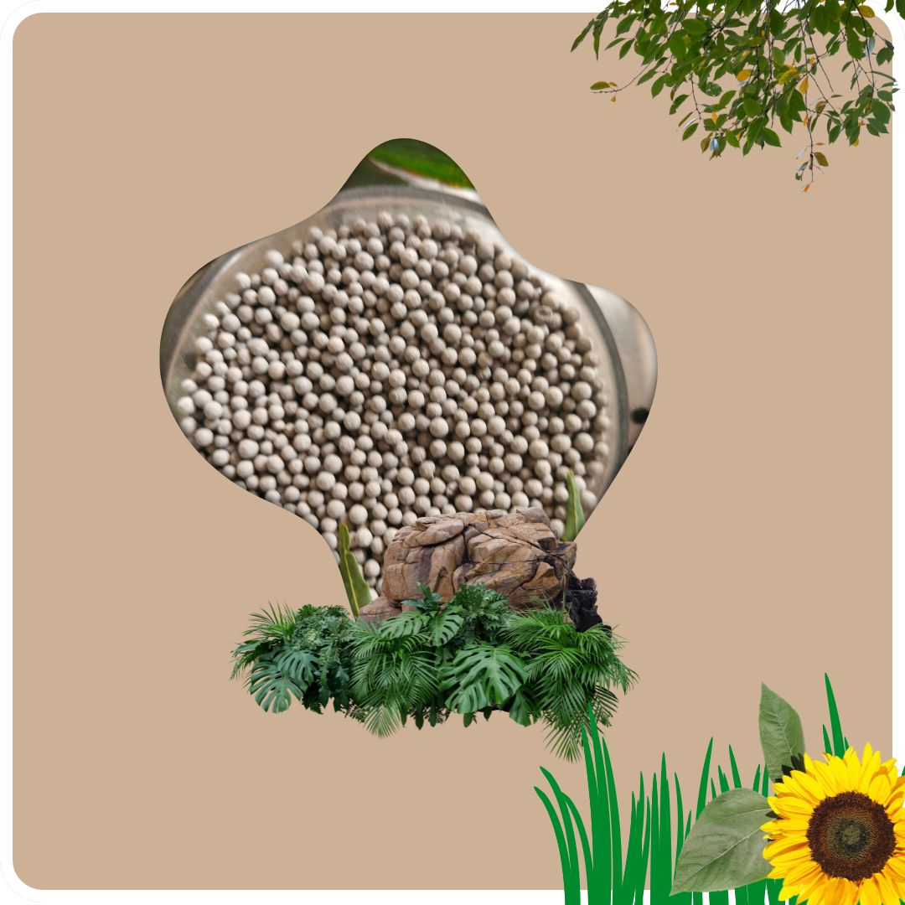
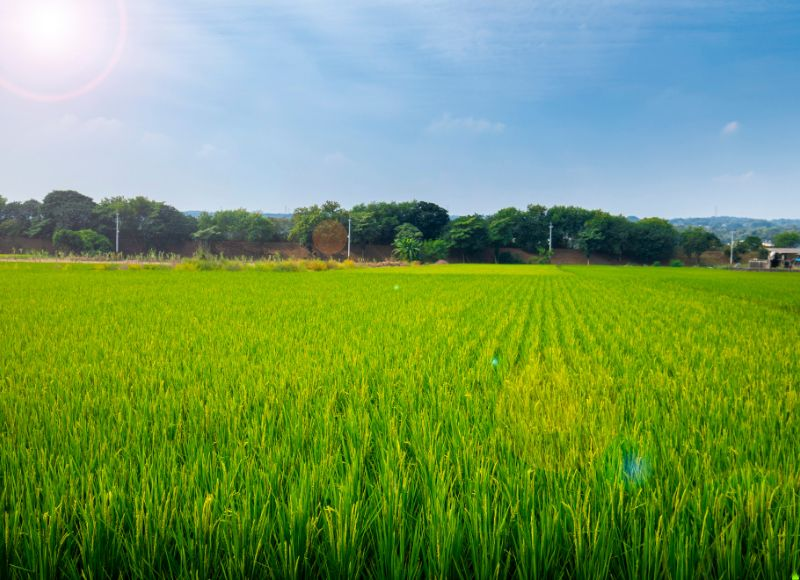
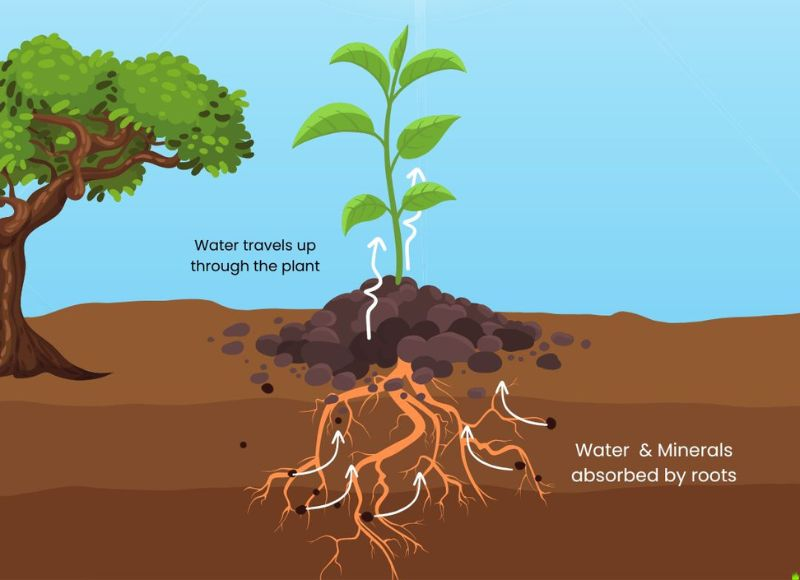

## What Is the Advantage of Mineral Coatings Over Traditional Bentonite?

Mineral-based fertilizer coatings replace inert sodium bentonite clay with chemically active mineral matrices such as Calcium Sulfate Dihydrate (Gypsum), Amorphous Silica, Dolomite, and Zeolite. Unlike sodium bentonite, which swells and forms sticky colloidal mud in high humidity, mineral coatings provide functional crop nutrients (Ca²⁺, Mg²⁺, SO₄²⁻, and plant-available H₄SiO₄), enhance granule crush strength above 4.0 kg, and optimize controlled nutrient diffusion without gumming commercial application machinery.



---

## The Chemical Limitations of Traditional Sodium Bentonite

For decades, the commercial agri-input industry relied heavily on sodium bentonite clay as a cheap binding agent and carrier for sulfur, zinc, and micronutrient granules. While bentonite offers binding properties, it introduces significant chemical and physical drawbacks:

1. **High Sodium Content and Soil Dispersion:** Sodium bentonite contains active exchangeable sodium (Na⁺). Repeated application on fine-textured soils elevates the Exchangeable Sodium Percentage (ESP), causing soil clay particles to deflocculate, destroy crumb structure, and form an impenetrable surface crust.
2. **Moisture Gumming and Application Clogging:** In humid warehouse storage or during monsoon broadcasting, bentonite's high swelling index (absorbing up to 15 times its dry volume in water) turns granules into gummy clumps that jam pneumatic seed drills and tractor spreaders.
3. **Zero Active Agronomic Nutrition:** Bentonite acts merely as an inert filler. It contributes negligible bio-available calcium, magnesium, or silicon to the growing crop.

```
Sodium Bentonite Hydration vs. Mineral Granule Dissolution:
Na-Montmorillonite + H₂O  →  Sticky Impermeable Gel (Zero Nutrient Release)
CaSO₄·2H₂O (Gypsum Coating) + H₂O  →  Ca²⁺ (Cation Flocculant) + SO₄²⁻ (Plant-Available Sulfate)
```

---

## The Next-Generation Mineral Carrier Matrix

By replacing inert clays with engineered mineral coatings, blenders and fertilizer manufacturers convert an inert carrier into an active soil conditioner and secondary nutrient supplier:

### 1. Gypsum Matrix (CaSO₄·2H₂O)
Supplies 18% to 21% bioavailable Calcium (Ca²⁺) and 14% to 16% Sulfate-Sulfur (SO₄²⁻). In sodic soils, the liberated calcium ions displace harmful exchangeable sodium from clay complexes, aggregating compacted soils and opening pore spaces for root aeration.

### 2. Biogenic Diatomite Silica (Amorphous SiO₂·nH₂O)
Diatomaceous earth carriers deliver high internal frustule porosity (65% to 75%) and a high liquid absorption capacity (up to 120% by weight). Diatomite slowly dissolves into orthosilicic acid (H₄SiO₄), depositing solid silica into plant epidermal cells to create physical lodging resistance and drought tolerance.



### 3. Dolomite Carrier [CaMg(CO₃)₂]
Delivers a balanced ratio of Calcium (20% to 22% Ca) and Magnesium (10% to 12% Mg). Magnesium sits at the core of the chlorophyll porphyrin ring, maximizing photosynthetic photon capture in crops with high vegetative biomass.

### 4. Natural Zeolite (Clinoptilolite Aluminosilicate)
Possesses a high Cation Exchange Capacity (CEC 120 to 180 cmol(+)/kg) and a 3D microporous lattice that captures ammonium (NH₄⁺) and potassium (K⁺) ions, releasing them gradually across 60 to 90 days to prevent leaching losses.



---

## Technical Comparison: Bentonite vs. Functional Mineral Coatings

| Engineering & Agronomic Property | Sodium Bentonite Clay | Gypsum / Silica Mineral Matrix |
| :--- | :--- | :--- |
| **Nutrient Value** | Inert filler (0% active Ca, Mg, S, Si) | Delivers active Ca²⁺, Mg²⁺, SO₄²⁻, and bio-available H₄SiO₄ |
| **Moisture Absorption Behavior** | Swells up to 1500%, forms sticky gel | High capillary absorption (120%) without sticky gumming |
| **Granule Hardness / Crush Strength** | 1.5 – 2.5 kg/granule (dust prone) | 3.5 – 5.0 kg/granule (high mechanical integrity) |
| **Effect on Soil Structure** | Disperses clay particles, increases compaction | Flocculates clay platelets, improves drainage and porosity |
| **Machinery Compatibility** | High risk of clogging drills in humid conditions | Free-flowing, smooth calibration in tractor spreaders |
| **Liquid Coating Load Capacity** | 3% – 5% maximum oil/liquid binder | 8% – 12% active biological/chemical active ingredient load |

---

## Frequently Asked Questions

### Can mineral-coated granules be blended with urea and DAP without chemical reaction?
Yes. Unlike raw alkaline clays, calcined gypsum and diatomite mineral granules have a neutral pH (6.5 to 7.5) and low moisture content (under 3%), making them fully compatible in physical bulk blends with Urea, DAP, and MOP without triggering hygroscopic melting.

### How do mineral coatings improve biological inoculant survival?
Porous diatomite silica and zeolite carriers provide micro-cavities that shield beneficial microbes (such as Mycorrhizal spores and Bio-NPK bacteria) from direct solar UV radiation and thermal stress during shipping and field broadcasting.

### What granule sizing is available for custom blending?
Standard industrial production is calibrated to uniform 2.0 mm to 4.0 mm round granules with over 90% sizing compliance, minimizing segregation in commercial bulk blenders.

---

*J K Fertilizers manufactures customized mineral carrier granules, coated granules, and organic fertilizers at our ISO-certified facilities in Anand, Gujarat. [Contact our technical engineering team](/contact) to discuss contract manufacturing specifications and custom formulations.*
