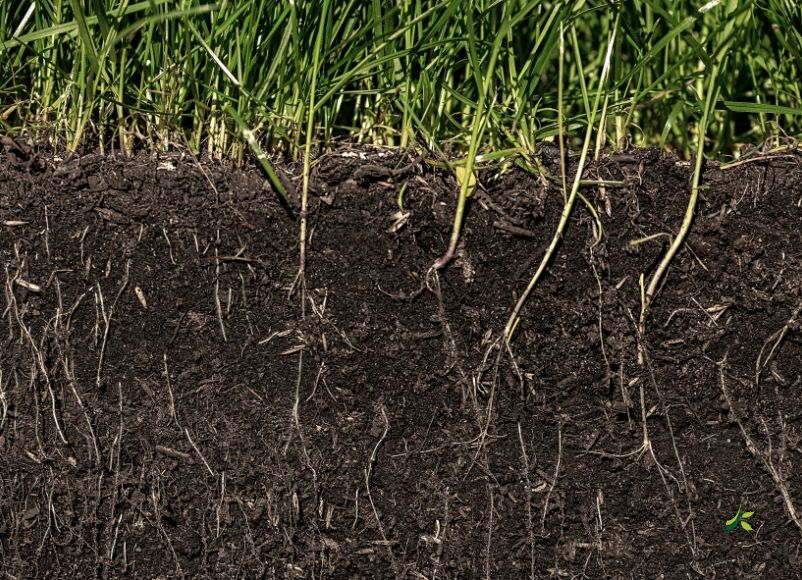
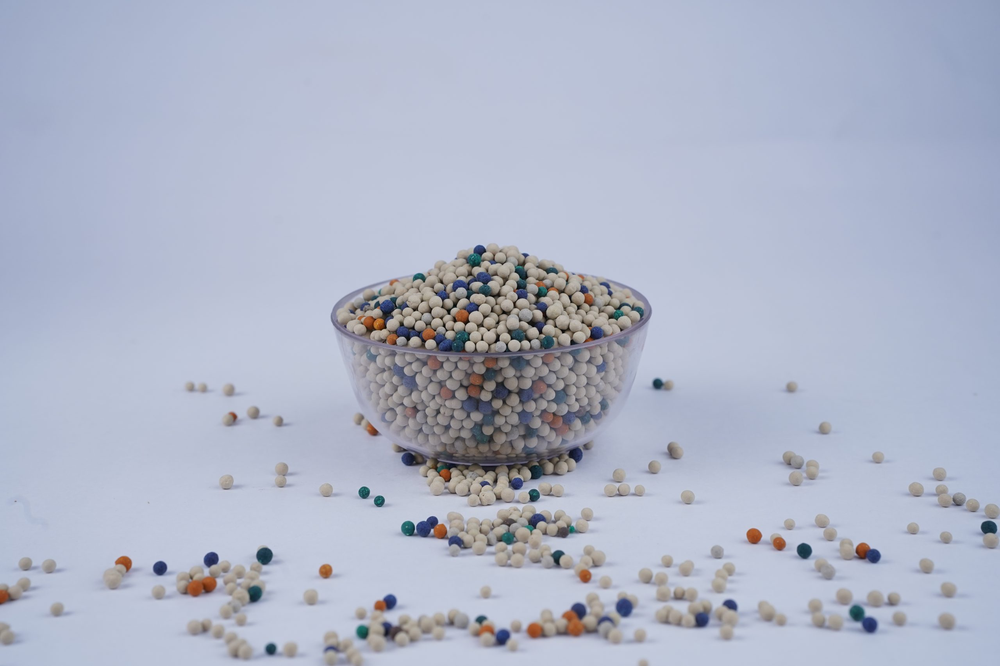

## Why Are Micronutrients Critical Despite Low Application Volumes?

Micronutrients (Zinc, Iron, Manganese, Boron, Copper, Molybdenum, and Chlorine) are essential chemical elements required by higher plants in trace quantities (10 to 200 ppm in plant tissue). While macronutrients (N-P-K) build physical plant tissues and cell walls, micronutrients function as indispensable catalytic cofactors and electron carriers for over 300 plant enzymes governing photosynthesis, auxin hormone biosynthesis, nitrogen reduction, and floral fertilization. Without adequate bioavailable micronutrients, major NPK fertilizers remain agronomically underutilized.



---

## The Biochemical Functions of Essential Micronutrients

```
Enzymatic Activation Pathway:
Apoenzyme (Inactive Protein) + Micronutrient Cofactor (Zn²⁺, Fe²⁺, Mn²⁺)
  → Active Holoenzyme  →  Cellular Metabolism (Photosynthesis, Protein Synthesis)
```

### 1. Zinc (Zn²⁺): Auxin Hormone & Protein Synthesis
- **Biochemical Role:** Zinc acts as an obligate catalytic cofactor for carbonic anhydrase (regulating CO₂ fixation) and RNA polymerase. It is essential for the biosynthesis of tryptophan, the amino acid precursor of **Indole-3-Acetic Acid (IAA / Auxin)**, which regulates internodal elongation and root apical growth.
- **Deficiency Symptom:** "Khaira disease" in paddy, interveinal chlorosis in maize/cotton ("white bud"), rosette leaf formation, and stunted internodes.

### 2. Iron (Fe²⁺/Fe³⁺): Chlorophyll Synthesis & Electron Transport
- **Biochemical Role:** Iron forms the prosthetic heme and iron-sulfur (Fe-S) clusters in cytochromes and ferredoxin, facilitating electron transport during Photosystem I and mitochondrial cellular respiration. While not present in the chlorophyll molecule itself, iron is an essential catalyst for chlorophyll synthesis enzymes.
- **Deficiency Symptom:** Striking interveinal chlorosis on the youngest upper leaves, progressing to ivory-white bleached leaves under acute deficiency.



### 3. Manganese (Mn²⁺): Photosystem II Water-Splitting
- **Biochemical Role:** Manganese is the central ion in the Oxygen-Evolving Complex (OEC) of Photosystem II (2 H₂O → O₂ + 4 H⁺ + 4 e⁻), driving the photolysis of water during light reactions.
- **Deficiency Symptom:** Interveinal chlorosis with distinctive necrotic gray or brown flecks ("marsh spot" in legumes and "gray speck" in oats).

### 4. Boron (BO₃³⁻): Cell Wall Integrity & Pollen Tube Elongation
- **Biochemical Role:** Borate ions crosslink rhamnogalacturonan-II (RG-II) pectic polysaccharides, providing physical structural rigidity to cell walls. Boron is indispensable for pollen grain germination, pollen tube elongation into the ovary, and fruit set.
- **Deficiency Symptom:** Hollow heart in groundnuts, cracked fruit rind in citrus and pomegranate, blossom drop, and brittle deformed growth tips.

### 5. Copper (Cu²⁺) & Molybdenum (MoO₄²⁻)
- **Copper:** Core component of plastocyanin (photosynthetic electron transport) and polyphenol oxidase (lignin cell wall synthesis).
- **Molybdenum:** Obligate constituent of **nitrate reductase** and **nitrogenase**, the enzyme complex driving symbiotic N₂ fixation in legume root nodules.


---

## The Micronutrient Chemical Matrix

| Micronutrient | Ionic Form Absorbed | Key Biochemical Enzymes | Critical Soil Deficiency Threshold | Common Fertilizer Source |
| :--- | :--- | :--- | :--- | :--- |
| **Zinc (Zn)** | Zn²⁺ | Carbonic anhydrase, Alcohol dehydrogenase | Below 0.60 ppm (DTPA) | Zinc Sulfate Monohydrate (33% Zn), Chelated Zn-EDTA (12% Zn) |
| **Iron (Fe)** | Fe²⁺, Fe³⁺ | Catalase, Peroxidase, Ferredoxin | Below 4.50 ppm (DTPA) | Ferrous Sulfate (19% Fe), Fe-EDTA / Fe-EDDHA (6% Fe) |
| **Manganese (Mn)**| Mn²⁺ | Photosystem II OEC, Superoxide dismutase | Below 2.00 ppm (DTPA) | Manganese Sulfate (30.5% Mn) |
| **Boron (B)** | H₃BO₃, BO₃³⁻ | Pectin RG-II crosslinking, Sugar transport | Below 0.50 ppm (Hot water) | Disodium Octaborate Tetrahydrate (20% B), Borax (10.5% B) |
| **Copper (Cu)** | Cu²⁺ | Plastocyanin, Cytochrome oxidase | Below 0.20 ppm (DTPA) | Copper Sulfate Pentahydrate (24% Cu) |
| **Molybdenum (Mo)**| MoO₄²⁻ | Nitrate reductase, Nitrogenase | Below 0.05 ppm (Ammonium oxalate) | Sodium Molybdate (39% Mo), Ammonium Molybdate (52% Mo) |

---

## Why Soil pH Dictates Micronutrient Bioavailability

In alkaline and calcareous soils (pH 7.5 to 8.5) across Gujarat, Maharashtra, Rajasthan, and northern India, metallic micronutrients (Zn²⁺, Fe²⁺, Mn²⁺, Cu²⁺) react rapidly with hydroxide (OH⁻) and carbonate (CO₃²⁻) ions, precipitating as insoluble oxides and hydroxides:

```
Precipitation of Zinc in High-pH Soil:
Zn²⁺ + 2 OH⁻  →  Zn(OH)₂↓ (Insoluble Zinc Hydroxide Precipitate, pH Above 7.5)
```

Applying micronutrients embedded in organic-rich humic carrier granules or coated with bio-sulfur prevents alkaline precipitation. The localized acidic rhizosphere micro-zone around the granule maintains metallic cations in water-soluble, chelated forms directly absorbable by root hairs.

---

## Frequently Asked Questions

### Why do broadcast chemical zinc salts often fail to increase crop yield?
When raw Zinc Sulfate is broadcast alone in alkaline soils, over 80% is fixed within 7 days. Encapsulating zinc inside mineral or humified organic granules protects the Zn²⁺ ion from alkaline soil contact, increasing plant uptake by up to 300%.

### How do I identify whether chlorosis is caused by Iron or Nitrogen deficiency?
- **Iron Deficiency:** Appears first on the **youngest upper leaves** because iron is immobile in plant vascular tissue.
- **Nitrogen Deficiency:** Appears first on the **oldest lower leaves** because nitrogen is mobile and translocated upward by the plant to support new growth.

---

*J K Fertilizers engineers multi-micronutrient coated granules, customized base carriers, and organic mineral fertilizers calibrated for commercial blenders and institutional distributors. [Contact our technical agronomists](/contact) to formulate region-specific micronutrient blends.*
