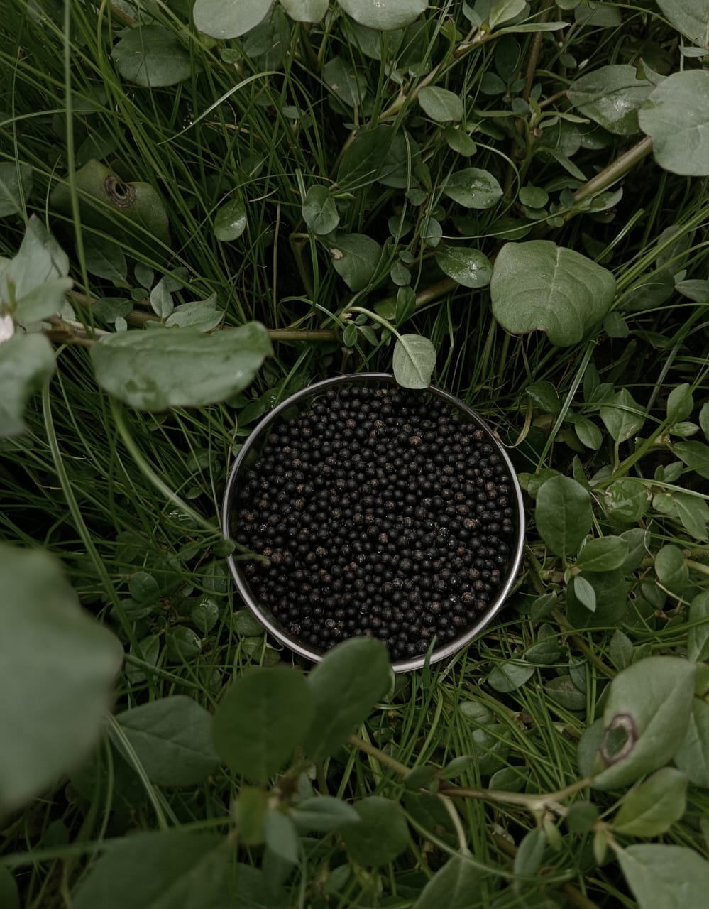
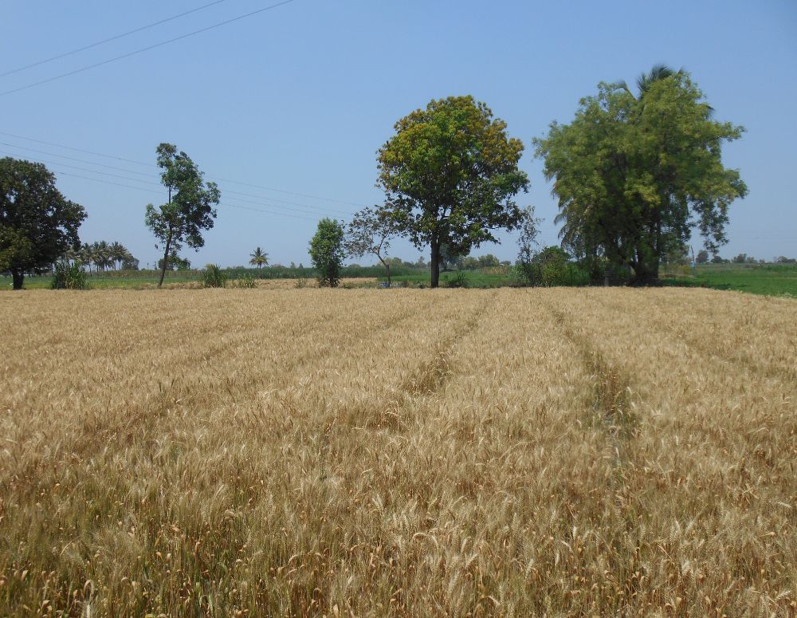

## What Is Mycorrhiza and How Does It Function in Agriculture?

Mycorrhiza is a mutualistic symbiotic association between specialized soil fungi (predominantly Arbuscular Mycorrhizal Fungi such as *Glomus intraradices*) and plant root systems. The fungal hyphae penetrate root cortical cells to form arbuscules for bidirectional nutrient exchange, extending the effective root surface area by 100 to 1,000 times. Mycorrhizae actively solubilize and transport immobile soil nutrients, particularly monovalent orthophosphate (H₂PO₄⁻), Zinc (Zn²⁺), and moisture, while secreting glomalin to build enduring soil aggregate stability.


---

## The Biological Mechanism of AMF Colonization

Arbuscular Mycorrhizal Fungi (AMF) do not replace plant roots; they form an expansive living extension of the rhizosphere known as the **mycorhizosphere**:

1. **Spore Germination and Appressorium Formation:** In response to strigolactone plant root signaling exudates, mycorrhizal spores germinate and form an appressorium on the root epidermis.
2. **Arbuscule Development in Cortical Cells:** Hyphae penetrate root cortical cells without rupturing the plasma membrane, branching into tree-like structures called arbuscules. Here, the fungus transfers mineral orthophosphate (H₂PO₄⁻), Zinc (Zn²⁺), Copper (Cu²⁺), and water to the host plant in exchange for photosynthetic hexose sugars and lipids (allocating 10% to 20% of plant photosynthate).
3. **Extra-Radical Hyphal Network:** The external mycelium extends several meters into soil micro-pores that root hairs (0.01 mm diameter) cannot physically access, exploring up to 100 times more soil volume than non-mycorrhizal roots.



---

## Biochemical Benefits of Mycorrhizal Inoculation

```
Hyphal Translocation Mechanism:
Immobile Soil Phosphate [Ca₃(PO₄)₂ / Fe-P] + Hyphal Phosphatase Enzymes
  → Soluble H₂PO₄⁻ (Polyphosphate Granules in Hyphae)
  → Rapid Cytoplasmic Streaming to Plant Arbuscules (Root Cortical Cells)
```

### 1. Enhanced Phosphorus and Micronutrient Transport
Orthophosphate ions move through soil primarily via slow diffusion (10^{-12} to 10^{-15} m^2/s), creating a localized phosphorus depletion zone around bare root hairs. AMF hyphae grow past this depletion zone, secreting acid phosphatases that hydrolyze organic phosphorus and mobilize locked zinc (Zn²⁺) and iron (Fe³⁺).

### 2. Drought Tolerance and Hydraulic Lift
The microscopic diameter of fungal hyphae (2 to 5 \mum) enables penetration of microscopic soil pores where capillary moisture remains trapped during moisture stress. Mycorrhizal plants maintain higher leaf water potential, elevated stomatal conductance, and reduced drought-induced wilting.

### 3. Soil Aggregation via Glomalin Secretion
AMF hyphae produce **glomalin**, a hydrophobic glycoprotein that acts as a natural biological cement. Glomalin binds mineral sand, silt, and clay particles into stable water-resistant macro-aggregates, increasing soil water infiltration by 30% to 50% and protecting organic carbon from rapid oxidation.



---

## Granular Carrier Technology vs. Liquid Mycorrhiza

In field agriculture, liquid spore drenches often suffer from high UV mortality, rapid thermal degradation during transport, and short shelf life. Engineered mineral granule carriers solve these vulnerabilities:

| Property / Feature | Liquid Spore Drench | Granular Mycorrhiza on Mineral Carrier |
| :--- | :--- | :--- |
| **Inoculum Form** | Suspended spores / liquid broth | Viable spores + vesicles + infected root fragments on porous mineral |
| **Infectivity Potential (IP)** | 10 – 20 IP/ml (unstable) | Minimum 100 IP/gm (guaranteed FCO specification) |
| **Substrate Protection** | Zero physical barrier against solar UV | Porous diatomite/bentonite shields spores from heat and radiation |
| **Application Method** | Requires separate drip tank mixing | Compatible with seed drills, basal fertilizer broadcasting, furrow placement |
| **Storage Shelf Life** | 3 to 6 months at controlled temperature | 12 to 24 months stable ambient storage |
| **Root Proximity** | Leaches past shallow seed zones | Granules sit directly in the furrow alongside germinating seeds |

---

## Application Protocols for Commercial Farming

- **Basal Soil Application (Granular):** Apply 4 kg to 8 kg per acre of granular mycorrhiza (100 IP/gm) during seedbed preparation or drilled in-furrow alongside seeds at planting.
- **Transplanting & Nursery Bed:** Mix 200 g granular mycorrhiza per square meter of nursery bed, or incorporate 50 g per potting mix bag before seedling transplantation.
- **Orchards & Plantation Crops:** Incorporate 50 g to 100 g per tree around the active drip-zone feeder roots annually during pre-monsoon or new flush root emergence.

---

## Frequently Asked Questions

### Can mycorrhizal granules be applied alongside chemical fertilizers?
Yes. Mycorrhizal granules can be blended with basal fertilizers such as PROM, PDM, and standard NPK blends. However, avoid concentrated chemical seed-treatment fungicides (e.g., systemic carbendazim or thiram) directly in the same furrow during inoculation to preserve fungal hyphal germination.

### How quickly does mycorrhizal colonization establish after planting?
Initial root penetration occurs within 3 to 7 days after seed germination. By day 21 to 28, a dense, functional extra-radical hyphal network is fully established across the root zone.

---

*J K Fertilizers manufactures FCO-compliant Mycorrhizal carrier granules delivering guaranteed \ge 100 IP/gm infectivity. [Contact our technical sales team](/contact) to discuss contract manufacturing, bulk base granules, and customized bio-fertilizer formulations.*
